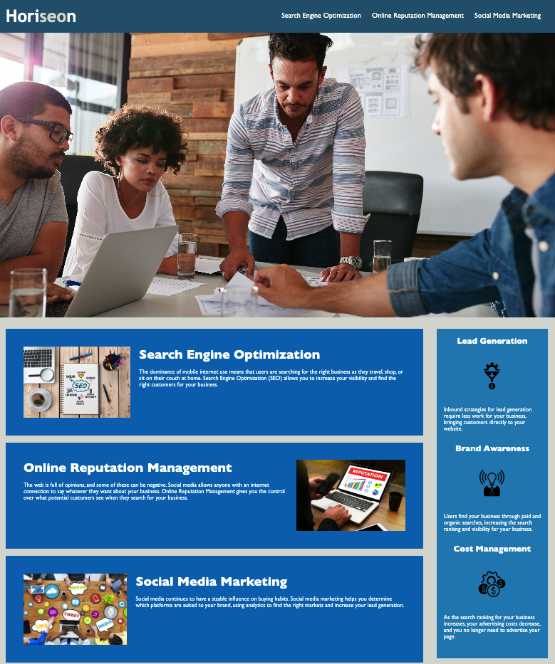

# HTML CSS Git Challenge: Code Refactor

***

## Description

Our task was to refactor the website of Horiseon, a fictional SEO Services company, with the aim to make it more accessible and optimized for search engines.
To meet accessiblity standards we completed the following:

- Semantic HTML elements are used
- HTML elements follow a logical structure 
- Image and icon elements contain alt attributes
- Heading attributes fall in sequential order
- Title elements contain a concise, descriptive title

***

## Screenshot

